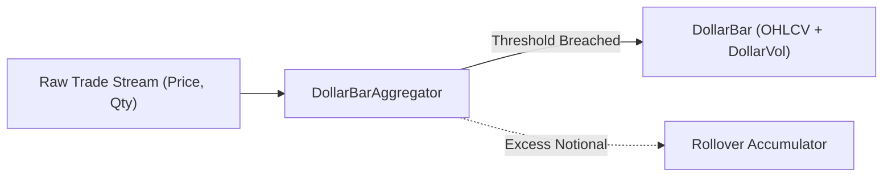

# Domain Architecture & Execution Lifecycle Specification

## 1. Architectural Philosophy
ATSNT follows Hexagonal Architecture (Ports and Adapters) with a Domain-First approach. The domain crate (`crates/domain`) contains pure, deterministic business logic with zero network, zero I/O, and zero asynchronous runtime dependencies.

All monetary, volume, and pricing figures strictly utilize fixed-point decimal arithmetic (`rust_decimal::Decimal`). Floating-point types (`f32`, `f64`) are strictly prohibited in domain financial logic.

---

## 2. Market Data Pipeline: Information-Driven Sampling



### 2.1 Atomic Market Events (`Trade`)
- Represents an executed market transaction.
- Invariants: `price > 0`, `quantity > 0`.
- Provides notional dollar value calculation: $\text{Notional} = \text{Price} \times \text{Quantity}$.

### 2.2 Streaming Aggregator (`DollarBarAggregator`)
- Rather than sampling over arbitrary calendar intervals ($1m, 5m$), transactions are accumulated into **Dollar Bars** based on total exchanged value:
  $$\sum (p_t \cdot v_t) \ge \theta_{\text{dollar}}$$
- **Rollover Principle**: If an incoming trade pushes accumulated volume past $\theta_{\text{dollar}}$, the excess notional value is transferred to the subsequent bar. This prevents sample truncation and statistical distortion.

---

## 3. Mathematical Foundations: CUSUM & Rolling Z-Score

### 3.1 Dynamic Z-Score Window (`RollingZScore`)
- Maintains an in-memory sliding window of $N$ dollar bar close prices using a double-ended queue (`VecDeque<Decimal>`).
- Features $O(1)$ mean update via running sum maintenance.
- Computes population standard deviation:
  $$\mu = \frac{1}{N}\sum_{i=0}^{N-1} x_i, \quad \sigma = \sqrt{\frac{1}{N}\sum_{i=0}^{N-1} (x_i - \mu)^2}, \quad Z = \frac{x_t - \mu}{\sigma}$$
- **Edge-case Protection**: If $\sigma = 0$ (flat price line), $Z$ resolves cleanly to $0$ without zero-division panics. While window length is less than $N$, queries return `None` (warm-up phase).

### 3.2 Symmetric CUSUM Filter (`CusumFilter`)
- Detects structural shifts in price momentum while discarding microstructural Gaussian noise (AFML Ch. 2.5).
- Operates on logarithmic returns:
  $$r_t = \ln\left(\frac{P_t}{P_{t-1}}\right)$$
- Maintains two bounded recursive accumulators:
  $$S_t^+ = \max(0, S_{t-1}^+ + r_t)$$
  $$S_t^- = \min(0, S_{t-1}^- + r_t)$$
- When $S^+ \ge h$ or $S^- \le -h$, a `CusumEvent` is emitted and that accumulator resets to zero.

---

## 4. Execution Lifecycle: The 3-Stage Pipeline

To prevent state desynchronization between trading logic and exchange state, execution is decoupled into three distinct stages:

```text
[ Strategy ]             [ Risk Manager ]                 [ Exchange / Backtest Engine ]              [ Portfolio ]
     │                           │                                       │                                  │
     │ 1. OrderIntent            │                                       │                                  │
     ├──────────────────────────►│                                       │                                  │
     │   (Direction, Reference,  │ 2. Order                              │                                  │
     │    Dynamic SL, TP)        ├──────────────────────────────────────►│                                  │
     │                           │   (Quantity sized to 1% risk,         │                                  │
     │                           │    Status: PendingNew)                │ 3. Executed Fills                │
     │                           │                                       ├─────────────────────────────────►│
     │                           │                                       │   (Order transitions to Filled)  │ Updates:
     │                           │                                       │                                  │ Position { Size, Entry, PnL }
```

### 4.1 Stage 1: Strategy Intent (`OrderIntent`)
- Represents an unverified trading wish emitted by a strategy.
- Contains directional intent (`Side`), target price, and the three barrier thresholds:
  - **Stop Loss Barrier**: Price invalidating the statistical hypothesis ($Z = \pm 3.5$).
  - **Take Profit Barrier**: Price reverting to equilibrium ($Z = 0$).
  - **Time Barrier**: Maximum holding duration in completed Dollar Bars.

### 4.2 Stage 2: Managed Order Finite State Machine (`Order`)
- Governs the exact order lifecycle on the broker/exchange.
- **Allowed State Transitions**:
  - `PendingNew` $\rightarrow$ `New` (Accepted by exchange book)
  - `PendingNew` $\rightarrow$ `Canceled` or `Rejected`
  - `New` $\rightarrow$ `PartiallyFilled` (Trade matched against book depth)
  - `New` $\rightarrow$ `Filled` (Completed fill)
  - `New` $\rightarrow$ `Canceled`
  - `PartiallyFilled` $\rightarrow$ `Filled` or `Canceled`
- **Illegal Transitions**: Attempting to cancel a `Filled` order or filling a `Canceled`/`Rejected` order triggers a `DomainError::InvalidStateTransition`.
- **Overfill Protection**: Accumulated fills cannot exceed original order quantity (`DomainError::OverfillError`).

### 4.3 Stage 3: Exposure Accounting (`Position`)
- Tracks active inventory and financial risk.
- **Mark-to-Market Accounting**: Computes real-time unrealized PnL:
  - Long: $(P_{\text{current}} - P_{\text{entry}}) \times \text{Quantity}$
  - Short: $(P_{\text{entry}} - P_{\text{current}}) \times \text{Quantity}$
- **Scale-in**: Adding to an existing position calculates weighted average entry price.
- **Scale-out**: Reducing or exiting positions locks in realized PnL.

---

## 5. Telemetry, Auditability & Event Logging
For simulations and live trading post-mortem analysis:
1. Every state mutation (`OrderIntent` emission, `Order` transition, `Fill`, `Position` change) produces a structured, timestamped domain event.
2. The backtest simulator and live adapters record these events to an in-memory ledger that can be serialized to JSON/Parquet for charting and visual reconstruction on the web dashboard.
