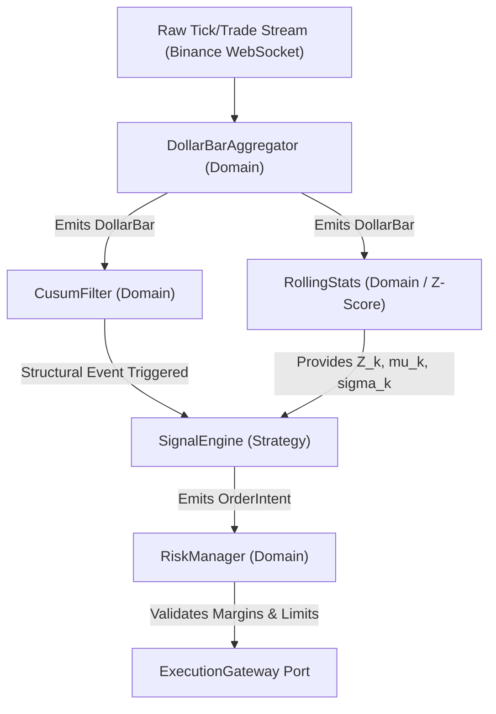

# Strategy Specification: Dollar Bars with Dynamic CUSUM & Z-Score

## 1. Objective
Establish an educational, robust, and mathematically sound trading pipeline in 100% Rust, implementing principles from Marcos López de Prado's *Advances in Financial Machine Learning* (AFML).

---

## 2. Mathematical Foundation

### 2.1 Information-Driven Sampling: Dollar Bars
Calendar time sampling ($1m, 5m, 1h$) introduces severe heteroscedasticity and non-normal return distributions. We sample bars by transaction value:

Given a stream of transactions $t \in \{1, \dots, T\}$ with trade price $p_t$ and volume $v_t$:
$$\text{Dollar Volume: } dv_t = p_t \cdot v_t$$

We accumulate dollar volume until a predefined threshold $\theta_{\text{dollar}}$ is reached:
$$\sum_{t=t_{k-1}+1}^{t_k} dv_t \ge \theta_{\text{dollar}}$$

Upon trigger:
- Open ($O$): $p_{t_{k-1}+1}$
- High ($H$): $\max(\{p_t\}_{t=t_{k-1}+1}^{t_k})$
- Low ($L$): $\min(\{p_t\}_{t=t_{k-1}+1}^{t_k})$
- Close ($C$): $p_{t_k}$
- Volume ($V$): $\sum v_t$
- Accumulated Dollar Volume ($DV$): $\sum dv_t$
- Reset accumulator to $0$ (or roll over remainder $\Delta = \sum dv_t - \theta_{\text{dollar}}$).

---

### 2.2 Event Sampling: Symmetric CUSUM Filter
The CUSUM (Cumulative Sum) filter is a quality-control test used to detect structural shifts in mean return, filtering out microstructural Gaussian noise.

Let $r_k$ be the log-return of bar $k$:
$$r_k = \ln\left(\frac{C_k}{C_k-1}\right)$$

Maintain two recursive tracking accumulators with threshold $h$ (calibrated as a multiple of rolling volatility $\sigma_k$):
$$S_k^+ = \max(0, S_{k-1}^+ + r_k - E[r])$$
$$S_k^- = \min(0, S_{k-1}^- + r_k - E[r])$$

Assuming zero drift $E[r] \approx 0$:
- If $S_k^+ \ge h$: Positive structural change event. Reset $S_k^+ = 0$.
- If $S_k^- \le -h$: Negative structural change event. Reset $S_k^- = 0$.

CUSUM decouples sampling from constant execution: execution logic runs **only** when a statistically meaningful shift has materialized.

---

### 2.3 State Evaluator: Rolling Z-Score
Once a CUSUM event is triggered, we evaluate whether price has deviated abnormally from its short-term equilibrium.

Given a rolling window of length $N$ on Dollar Bar close prices $C_k$:
$$\mu_k = \frac{1}{N}\sum_{i=0}^{N-1} C_{k-i}$$
$$\sigma_k = \sqrt{\frac{1}{N}\sum_{i=0}^{N-1} (C_{k-i} - \mu_k)^2}$$
$$Z_k = \frac{C_k - \mu_k}{\sigma_k}$$

#### Signal Generation Matrix:
- **Mean Reversion Regime**:
  - If $S_k^+ \ge h$ and $Z_k > +Z_{\text{threshold}}$: Asset extended to the upside; expect pullback $\rightarrow$ Short Intent / Exit Long.
  - If $S_k^- \le -h$ and $Z_k < -Z_{\text{threshold}}$: Asset extended to the downside; expect bounce $\rightarrow$ Long Intent / Exit Short.
- **Trend Continuation Regime**:
  - Alternative mode where sustained $S_k^+ \ge h$ with expanding volatility indicates breakout.

---

## 3. Rust Architectural Mapping

### Key Domain Principles:
1. **Zero Allocations in Hot Paths**: Pre-allocate circular buffers for rolling statistics.
2. **Deterministic Arithmetic**: `rust_decimal::Decimal` utilized for prices, trade sizes, and accumulated volume.
3. **Pure Functions**: `DollarBarAggregator` and `CusumFilter` implement stateful domain structs without asynchronous runtimes or I/O.

---

## 4. Position Sizing & Risk Management

In leveraged derivatives, leverage is an output of risk management, never an arbitrary input:

### 4.1 Fixed Fractional Position Sizing
Given:
- $\text{Equity}$: Total account balance in USDT.
- $R_{\text{trade}}$: Maximum capital fraction risked per trade (e.g., $1.0\% = 0.01$).
- $P_{\text{entry}}$: Fill price.
- $P_{\text{stop}}$: Price corresponding to Stop Loss barrier ($Z_{\text{stop}}$).

$$\text{Capital at Risk (\$) } = \text{Equity} \times R_{\text{trade}}$$
$$\text{Per-Unit Risk (\$) } = |P_{\text{entry}} - P_{\text{stop}}|$$
$$\text{Quantity (BTC) } = \frac{\text{Capital at Risk}}{\text{Per-Unit Risk}}$$

### 4.2 Effective Leverage
$$\text{Leverage}_{\text{eff}} = \frac{\text{Quantity} \times P_{\text{entry}}}{\text{Equity}}$$
If $\text{Leverage}_{\text{eff}} > \text{Leverage}_{\text{max}}$ (exchange or account ceiling), position size is clamped to maintain risk invariants.

### 4.3 Circuit Breakers (Account Level)
- **Max Daily Drawdown**: Halt trading if intraday loss exceeds $D_{\text{max}}$ (e.g., $5\%$).
- **Consecutive Loss Cooldown**: Pause execution after $N_{\text{losses}}$ consecutive stop-outs.

---

## 5. Hyperparameter Registry

| Parameter | Type | Default | Description |
| :--- | :--- | :--- | :--- |
| `dollar_bar_threshold` | `Decimal` | `1,000,000` | Dollar value per bar ($P \times Q$ in USDT). |
| `rolling_window_len` | `usize` | `20` | Lookback period for mean ($\mu$) and standard deviation ($\sigma$). |
| `cusum_vol_multiplier` | `Decimal` | `2.0` | Multiplier for dynamic CUSUM threshold $h = \text{mult} \times \sigma$. |
| `z_entry_threshold` | `Decimal` | `2.0` | Z-score trigger point for exhaustion entry. |
| `z_stop_threshold` | `Decimal` | `3.5` | Z-score barrier for stop-loss invalidation. |
| `time_barrier_bars` | `usize` | `15` | Maximum bar duration before forced position exit. |
| `risk_per_trade_pct` | `Decimal` | `0.01` | Maximum risk per trade ($1\%$ of account equity). |
| `max_daily_drawdown_pct`| `Decimal` | `0.05` | Circuit breaker threshold for daily loss ($5\%$). |

---

## 6. Backtest & Performance Evaluation Metrics

To avoid backtest overfitting and false discoveries, we track metrics emphasizing risk-adjusted returns and downside protection:

### 6.1 Return & Efficiency Metrics
- **Mathematical Expectancy ($E$)**:
  $$E = (W \cdot \overline{G}) - (L \cdot \overline{P}) - \text{Fees} - \text{Slippage}$$
  Where $W$ is win rate, $\overline{G}$ is average gain, $L$ is loss rate ($1 - W$), and $\overline{P}$ is average loss. Must remain strictly positive after transaction costs.
- **Profit Factor ($PF$)**:
  $$PF = \frac{\sum \text{Gross Profits}}{\sum \text{Gross Losses}}$$
  Benchmark: $PF > 1.5$.
- **Win Rate vs. Payoff Ratio**: Win rate is never evaluated in isolation; it must be coupled with the Payoff Ratio ($\overline{G} / \overline{P}$).

### 6.2 Risk-Adjusted Ratios
- **Sortino Ratio**:
  $$\text{Sortino} = \frac{R_p - R_f}{\sigma_d}$$
  Penalizes only downside semivariance ($\sigma_d$), discarding upside volatility.
- **Sharpe Ratio & Deflated Sharpe Ratio (DSR)**: Standard Sharpe adjusted for non-normal return distributions (skewness, kurtosis) and multiple testing trials (AFML Ch. 14).
- **Calmar Ratio**:
  $$\text{Calmar} = \frac{\text{Annualized Return}}{\text{Max Drawdown}}$$
  Measures recovery velocity against maximum historical pain.

### 6.3 Friction & Microstructure Reality
- **Fee Drag**: Cumulative percentage of gross profits consumed by Binance maker/taker fees and funding rates.
- **Slippage Impact**: Simulated latency penalty between signal timestamp and fill timestamp.

