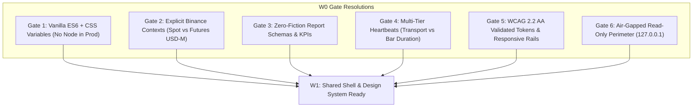

# W0 — Technical & Design Decision Gates (Read-Only Web Workspace)

> [!NOTE]
> **Status: Decommissioned & Archived (Milestone 5)**
> As part of **Milestone 5 ("Web Decommission & Decoupled Cloud-First Analytics")**, the in-process web application (`crates/web`, W0–W6) was retired. Read-only visualization and BI reporting are now fulfilled via **Google Cloud BigQuery (`atsnt_bi`) + Looker Studio**, and real-time alerts via **Telegram Bot**. This task specification is retained solely for historical audit.

Branch: `main` | Status: Archived
Document Version: 1.0.0
Authoritative Contract: [`docs/architecture/09-read-only-web-workspace.md`](../../docs/architecture/09-read-only-web-workspace.md)

---

## 1. Goal & Architectural Purpose
The goal of **W0** is to eliminate unverified assumptions, ambiguity, and technical debt *before* authoring frontend code for the **Read-Only Web Workspace** (Phases W0 through W6). 

W0 serves as a strict **Decision & Specification Gate**:
1. It resolves all 6 open technical gates identified in Section 2 of the canonical workspace architecture.
2. It establishes explicit contracts for UI architecture, data serialization, report reconciliation, heartbeat thresholds, and accessibility.
3. It guarantees that subsequent implementation in **W1 (Shared Shell & Design System)** proceeds on top of verified, deterministic constraints without rewriting or retrofitting core requirements.

---

## 2. Resolution of the 6 Technical Gates



---

### Gate 1: Frontend Architecture & Shared Package Topology

* **Confirmed Topology:** Portal, Trading Workspace, and Econoweb operate as separate single-page applications. Portal acts as an application launcher, not a consolidated dashboard.
* **Stack Decision: Modern Vanilla ES6 Modules + Native CSS Custom Properties.**
  * *Rationale:* Adheres to ATSNT's core engineering philosophy of owning mechanics with zero black-box dependencies. Avoids introducing Node.js, `npm`, bundlers (Webpack/Vite), or node_modules into the Rust distribution or server runtime.
  * *Asset Hosting:* Axum serves the static assets directly from `crates/web/static/` via `tower_http::services::ServeDir`.
* **Static Directory Organization for W1:**
  ```text
  crates/web/static/
  ├── css/
  │   ├── tokens.css        # Palette, typography, spacing, radii, elevations
  │   ├── shell.css         # Global rail, module rail, header, drawer, layouts
  │   └── components.css    # Metric cards, tables, badges, tabs, alerts
  ├── js/
  │   ├── app.js            # Main bootstrap and router
  │   ├── state.js          # Reactive state container with sticky uncertainty
  │   ├── ws.js             # WebSocket client with heartbeat and reconnection
  │   ├── i18n.js           # Bilingual translations dictionary (ES / EN)
  │   └── views/
  │       ├── operations.js # Live/Paper operations and chart
  │       ├── laboratory.js # Backtest, HPO, and Monte Carlo viewer
  │       ├── strategies.js # Strategy catalog and instance status
  │       └── system.js     # Health, lag, and transport diagnostics
  ├── index.html            # Main SPA HTML structure
  └── vendor/               # Lightweight Charts (TradingView) library
  ```
* **Shared Design Tokens:** All visual tokens are defined in `:root` inside `tokens.css` so they can be exported and mirrored cleanly across Portal and Econoweb without code duplication.

---

### Gate 2: Source & Read-Model Schemas (API DTOs & Account Contexts)

* **Explicit Account Contexts:**
  * Context selector controls the global view: **Spot Standard** vs. **USDⓈ-M Futures (USDT, isolated, one-way)**.
  * Wallets are never pooled or aggregated. Spot assets are never treated as Futures margin collateral.
* **Precision & Serialization:**
  * **Zero Floating-Point Rule:** All monetary quantities, prices, balances, fees, and PnL serialize as decimal strings (`String` in JSON, backed by `rust_decimal::Decimal` in Rust).
  * **Timestamps:** Unix millisecond integers (`u64`). The UI distinguishes between `event_timestamp` (trade execution time at exchange) and `server_timestamp` (telemetry envelope generation time).
* **Telemetry Telemetry Resiliency (Consuming T2a/T2b/T3):**
  * Preserves the 5-field envelope:
    ```json
    {
      "timestamp": 1791199893000,
      "strategy_id": "DollarBarsCusum_v1",
      "symbol": "BTCUSDT",
      "event_type": "DollarBar",
      "payload": { ... }
    }
    ```
  * **Sticky Uncertainty:** When aggregator lag or client socket disconnection occurs, the server emits `stale: true`. The client renders persistent visual uncertainty (amber warning badge) until an authoritative resync snapshot arrives.
  * **Mode Identification:**
    * `--mock`: Persistent high-contrast **DEMO** badge; synthetic prices are never masqueraded as exchange capital.
    * `--paper`: Live in-process paper session with real market tick ingestion.

---

### Gate 3: Versioned Accounting & Report Evidence (Zero-Fiction Rule)

* **Audit of `storage/reports/` Schemas:**
  * Audited empirical JSON produced by `backtest` and `run_hpo`.
  * Structure verified:
    * `backtest_config`: initial capital, fee percentages (maker/taker), slippage, risk per trade, max daily drawdown.
    * `metrics`: gross profit, gross loss, net profit, win rate, sortino ratio, total trades, fees, slippage, expectancy, profit factor, max drawdown amount/percent.
    * `strategy_config`: CUSUM parameters, rolling window, barriers.
    * `closed_trades`: Array of completed trade executions.
* **Reconciliation of Monte Carlo Trajectories:**
  * The report parser is standardized to accept both `fan_chart_curves` and `fan_chart_trajectories` keys gracefully, preventing client exceptions on historical schema variants.
* **The "Zero-Fiction" Principle:**
  * **No Fabricated Curves:** If a report does not contain an equity curve time series, the UI explicitly displays *"Historical series not available"* instead of synthesizing a fake 2-point line with current clock time.
  * **No False Zeros:** Unsupported metrics (such as funding rate on Spot) display as *N/A* or *Unknown*, never *0.00*.

---

### Gate 4: Heartbeat & Freshness Contracts

* **Irregular Dollar Bar Durations:**
  * Dollar Bars are volume-clock bars (forming after $5,000 or $50,000 notional volume), **not wall-clock bars**.
  * A 30-minute span without a new Dollar Bar during quiet market hours is standard behavior and does not signify connection failure.
* **Multi-Tier Freshness Indicators:**
  1. **Transport Heartbeat:**
     * Client monitors ping/pong frames and regular telemetry ticks.
     * Warning threshold: **> 5 seconds** without frames $\rightarrow$ Status: `Lagging / Stale`.
     * Reconnect threshold: **> 15 seconds** without frames $\rightarrow$ Status: `Disconnected / Reconnecting`.
  2. **Market Trade Freshness:**
     * Displays elapsed seconds since the last incoming trade print.
  3. **Bar Formation Freshness:**
     * Displays duration and timestamp of the last *finalized* Dollar Bar alongside the progress percentage of the current *provisional/forming* bar.

---

### Gate 5: Visual Tokens & WCAG 2.2 AA Accessibility

* **Empirical Color Palette & Contrast Ratios (W3C Formula Validated):**

| Token | Hex Value | Role | Ratio vs `#0B1120` | Ratio vs `#111827` | WCAG 2.2 Status |
|---|---|---|---|---|---|
| `--bg-base` | `#0B1120` | Root background | N/A | N/A | Base |
| `--bg-surface` | `#111827` | Card/panel surface | N/A | N/A | Base |
| `--bg-elevated` | `#1E293B` | Modals / Hover | N/A | N/A | Base |
| `--text-primary` | `#F1F5F9` | Headings, main metrics | **17.19 : 1** | **16.19 : 1** | **PASS (AAA)** |
| `--text-secondary` | `#94A3B8` | Labels, metadata, units | **7.35 : 1** | **6.92 : 1** | **PASS (AA)** |
| `--accent-blue` | `#3B82F6` | Active controls & focus ring | **5.12 : 1** | **4.82 : 1** | **PASS (AA & UI)** |
| `--positive-green`| `#22C55E` | Profits, Buy signals | **8.28 : 1** | **7.79 : 1** | **PASS (AA)** |
| `--negative-red`  | `#F87171` | Losses, Sell signals | **6.81 : 1** | **6.41 : 1** | **PASS (AA)** |
| `--warning-amber` | `#FBBF24` | Stale, lag, uncertainty | **11.30 : 1** | **10.63 : 1** | **PASS (AAA)** |
| `--border-subtle` | `#334155` | Card dividers & borders | **1.82 : 1** | **1.71 : 1** | Non-text visual separator |

* **Focus Indicators:** Active interactive controls utilize `--accent-blue` (`#3B82F6`, 4.82:1 ratio), comfortably exceeding the 3.0:1 requirement for WCAG 2.1/2.2 Non-text Contrast (1.4.11).
* **Responsive Breakpoints:**
  * **Desktop ($\ge 1200\text{px}$):** Persistent global rail (collapsed to 64px) + full trading module rail (224px).
  * **Tablet ($768\text{px} - 1199\text{px}$):** Collapsed global rail (64px) + collapsible trading module rail.
  * **Mobile ($< 768\text{px}$):** Unified sliding drawer with keyboard navigation, visible focus ring, and `Escape` key dismissal.
* **Locale & Dual Clock:**
  * Language dictionary: Spanish (default) and English.
  * Time display: Primary **UTC** clock (financial standard) with secondary browser Local Time and timezone offset badge.

---

### Gate 6: Deployment & Perimeter Security

* **Air-Gapped Loopback Binding:** Server binds strictly to loopback (`127.0.0.1` or `::1`). Public interfaces (`0.0.0.0`) fail closed at launch.
* **Origin & Host Verification:**
  * Validates exact configured scheme, host, and port for all HTTP and WebSocket upgrade requests.
  * Proxy headers (`X-Forwarded-For`, `X-Forwarded-Host`) are explicitly distrusted.
* **Zero Credential Exposure:**
  * API keys, HMAC secret keys, and exchange listenKeys are **never** delivered to the browser.
* **Read-Only Invariant:**
  * Web API offers only `GET` and `/ws/telemetry`.
  * Order placement, order cancellation, and strategy modification are strictly impossible through web endpoints.

---

## 3. Deliverables and Acceptance Criteria

- [x] **D1:** Comprehensive audit and resolution of all 6 technical gates recorded in this document.
- [x] **D2:** Mathematical validation of WCAG 2.2 AA contrast ratios for the complete color palette.
- [x] **D3:** Canonical update to [`docs/architecture/09-read-only-web-workspace.md`](../../docs/architecture/09-read-only-web-workspace.md) marking the open technical gates as resolved.
- [x] **D4:** Clear contractual baseline established for initiating **W1 (Shared Shell & Design System)**.
